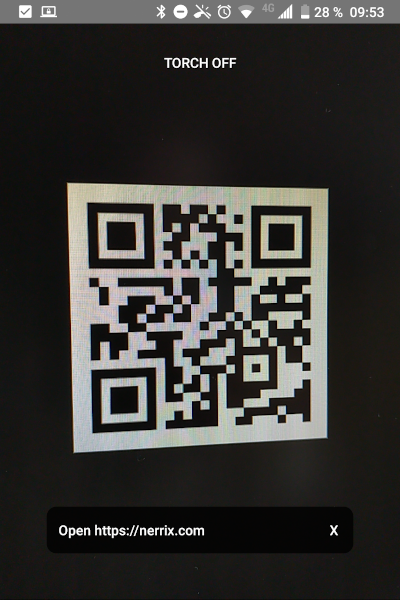

# Simple QR

A simple QR scanner for Android. Created by using CameraX from AndroidX and Xamarin.Android.

## Features

- Open URLs
- Read WIFI information (copy password)
- Copy plain text
- Phone number

### Supported Languages

- English
- German

## Roadmap

QR Code data patterns to come:

- E-Mail
- Event
- Location
- WIFI (connect directly)
- VCard (add contact)
