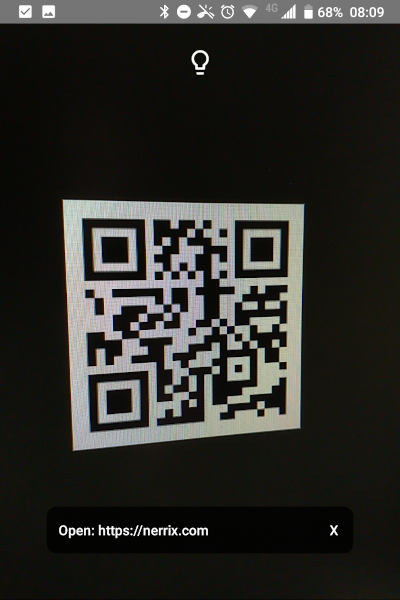

# Simple QR

A simple QR scanner for Android. Created by using CameraX from AndroidX and Xamarin.Android.

## Features

- Open URLs
- Read Wifi Information (copy password)

## Roadmap

QR Code data patterns to come:

- Plain text
- E-Mail
- Event
- Location
- Phone number
- Wifi (connect directly)
- VCard
